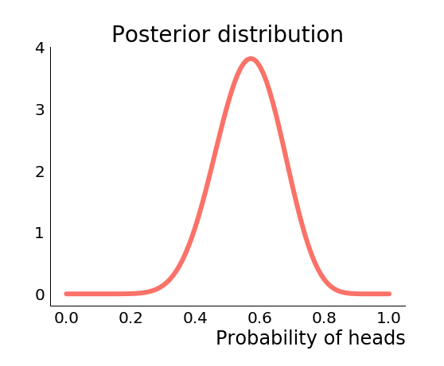

This is the third and final post in a series on election modelling; specifically
multi-level regression with poststratification (MRP) and its successful use by
YouGov in the 2017 general election.

In the previous posts we learnt the basics of conventional polling, Bayesian
statistics, and computational inference. This should give us all the tools we
need to understand how MRP works.

## Overview

Recall that in the first post we observed that one of the main issues with basic
polling analyses is that they are in some sense answering the wrong question.
Specifically we are estimating national vote share, but often it can be hard to
translate this into a result, as support for the different parties is not evenly
distributed.

What we want to do is produce an estimate of vote share _in each constituency_.
However, performing a separate poll in every constituency is impractical, both
financially and logistically. So we want to come up with a way to produce an
estimate in each constituency from a single national poll.

We do this in two steps:

1. We will build a model that predicts how an individual will vote based on
   their demographics. The model will take into account things like age,
   education, past voting behaviour etc. This is the multilevel regression (MR)
   of MRP.
2. Using the model, we can make predictions for each demographic group, then
   combine that with information about the demographics of each constituency to
   produce a constituency specific estimate of vote share. This is the
   poststratification (P) of MRP.

This way we can effectively use data collected at the national level to produce
local estimates. This high-level summary hides many interesting details, so lets
look at each step in more detail.

## Modelling the electorate

Our goal is to build a model that can predict how someone will vote given their
demographics. Let's start by considering a simple logistic regression model.
Once we've done that we can use the simple model to understand
poststratification. Finally once we've understood the basics of both steps,
we'll look at how we can build more powerful models.

We'll assume the demographic features we have measured are age, sex, education,
vote at the last general election, and vote in the EU referendum. Writing out
these models can get a bit messy, but I think it's generally helpful to see the
formulas. We'll use the following notation:

- $P$ is the number of parties we are including in the model.
- $y_{i}$ is the party of choice for individual $i$. It is an integer in the
  range $1, \dots, P$.
- $\gamma_{ip}$ is the probability of individual $i$ voting for party $p$.
- $x^{age}_i$ is the age of individual $i$. We use similar notation for the
  other features.
- $\alpha_p$, and $\beta^{age}_p$ are parameters in the model, the index $p$
  determining which party the prediction is made for.

A simple choice of model would be logistic regression. Specifically we aim to
learn parameters $\alpha_p$ and $\beta^{age}_p$, $\beta^{sex}_p$,
$\beta^{edu}_p$, $\beta^{ge}_p$ and $\beta^{eu}_p$ for each party $p$ such that
$\gamma_{ip}$, the probability that individual $i$ votes for party $p$ satisfies

$$
    \gamma_{ip} = \sigma(\alpha_p + \beta^{age}_p x^{age}_i + \dots + \beta^{eu}_p x^{age}_i),
$$

where $\sigma$ is the
[sigmoid function](https://en.wikipedia.org/wiki/Sigmoid_function).

For the non-ordered categorical variables such as $x^{ge}_i$ we would really
need to one-hot encode the feature and have multiple parameters, but I'm going
to ignore that for notational convenience.

The party that individual $i$ then selects as their preferred party is
understood as a categorical random variable with probabilities
$\boldsymbol{\gamma}_{i}$

$$
    y_{i} \sim \mathrm{Categorical}(\boldsymbol{\gamma}_i).
$$

That's pretty much all we need for the simple version of this model! We can
survey a portion of the electorate, ask them not only who their first choice of
party is, but also their demographics. Given this data we can learn the
parameters $\boldsymbol{\alpha}$, $\boldsymbol{\beta}^{age}$ etc. in the
standard way. Then given a new individual, we can calculate their probabilities
of favouring each party, $\boldsymbol{\gamma}$, and convert that into a choice
by sampling from the categorical distribution with those probabilities.

## Poststratification

Suppose we have a way of predicting how someone will vote given their
demographics. It might be as simple as the logistic regression model we looked
at above, or it could be something much more complicated. Poststratification
allows us to use these predictions to estimate vote share in each constituency.

The idea is actually pretty simple: to get the vote total for a particular
party, we will sum up the number of people in the constituency of each
demographic group, weighted by the probability that demographic group votes for
the party in question.

For example, let's suppose our model predicts that 25-34 year old women with a
university education who voted Labour at the last election and voted to remain
in the EU have a probability $0.85$ of voting Labour this time around. Then if
there are 100 25-34 year old women with a university education who voted Labour
at the last election and voted to remain in the EU, we expect that Labour will
get 85 votes from this demographic group.

We repeat that process for all demographic groups, multiplying the number of
people in the group by the probability any one of them will vote for a
particular party. Summing the totals over all groups we get an estimate for the
number of votes that party will get in that constituency.

This gives us estimates that are specific to each constituency. There are two
problems though. The first is that in order to carry out this procedure we need
to know how many representatives of each demographic group that we are modelling
lives in each constituency. Building such a picture of the demographic makeup
typically requires the combination of a number of data sources and some
additional modelling.

The challenge is really that we need to estimate the full joint distribution of
the demographics we are modelling, but often we just have access to marginal
distributions. For example we know how many people voted for a given party in
any particular constituency, but we don't actually know who those people were.

YouGov have not revealed much about how they built this demographic model of the
UK, but they did say they used a combination of census data, the annual
population survey and their own proprietary data from their panel.

The second problem is that we have assumed that demographics affect an
individual's party preference in the same way in every single constituency.
Ideally we want to train a model that produces probabilities for each
demographic group specific to the constituency they live in. That's what we'll
do next.

## Adding constituency features

The first thing we can do is to include constituency-level features in the model
in addition to the individual-level features. There are many options here,
things like population density (as a proxy for urban / rural divides),
proportion of students, proportion who voted to leave the EU etc. tend to
correlate pretty well with outcomes.

For simplicity let's suppose that we just include population density in our
model denoted $c^{pd}_j$. Including additional features is completely analogous.
We want to learn parameters $\xi^{pd}_p$ such that

$$
    \gamma_{ip} = \sigma(\alpha_p + \xi^{pd}_p c^{pd}_{j(i)} + \beta^{age}_p x^{age}_i + \dots + \beta^{eu}_p x^{age}_i).
$$

We use the notation $j(i)$ to denote the constituency that individual $i$ lives
in. The parameters $\xi^{pd}_p$ adjust the probabilities $\gamma_{ip}$ for the
population density of constituency $j(i)$. This means our predictions now depend
on the characteristics of the constituency, not just the demographics of the
inhabitants. This is an improvement, but we can still do better.

## Hierarchical models

One shortcoming of our model so far is that it implicitly assumes that the
effect of individual features on vote choice does not vary between
constituencies. In reality we might expect this to vary. Perhaps in rural
constituencies age does not correlate as strongly with likelihood of voting
Labour as it does in urban constituencies.

We could try not pooling our data, learning different values for the parameters
in every constituency. In that case though, the small amounts of data in each
constituency could lead to estimates with limited utility.

Ideally we want to find an approach that represents a compromise between these
two extremes of pooling all our data, and modelling each constituency as
completely independent. A pragmatic approach might be to compute a weighted
average of the pooled estimate and the unpooled estimate. Then the estimates for
each constituency are close to the national estimate, but also are allowed to
vary based on the data observed in that constituency. As a result we are less
likely to make an extreme estimate due to small data, but we also get estimates
tailored to each constituency.

It turns out that hierarchical models are a principled way of achieving this
compromise, and in some cases are actually equivalent to taking a weighted
average of the two estimates. Rather than explicitly taking an average, we
achieve the compromise through our choice of prior.

### Priors as regularisers

We saw in part 2 that when we have a lot of data, our inferences are not
terribly sensitive to our choice of prior. Only when we have small amounts of
data is the posterior distribution of our parameters influenced significantly by
the choice of prior distribution. This might be a cause for concern if you worry
about the subjectivity of the prior.

Conversely, suppose that the prior were well-informed, that is the knowledge it
represents is known to be accurate for some reason. Then we can view the prior
as capturing a large portion of our knowledge of the parameters, and the small
amount of data we have is used to make fine adjustments.

Let's think again about the coin flipping example. Suppose we are given a coin
and we need to estimate the probability of getting heads (denoted $\theta$) when
we flip the coin. But suppose also that we only get to flip the coin three
times, we do and we get three heads. What should we estimate $\theta$ to be? If
we took a non-Bayesian approach and calculated the
[maximum likelihood estimate](https://en.wikipedia.org/wiki/Maximum_likelihood_estimate)
we would estimate $\theta$ to be $1$! But such an estimate is probably
unreasonable...

Say though that we knew something about the machine that made the coin. In
particular we knew that the average value of $\theta$ for coins produced by the
machine was $0.5$, and the standard deviation in $\theta$ is $0.1$. We could
encapsulate this knowledge by placing a $\mathrm{Beta}(10, 10)$ prior on
$\theta$. Now if we observed three heads in a row, instead of estimating
$\theta = 1.0$, we obtain a $\mathrm{Beta}(13, 10)$ posterior on $\theta$, which
has mean $0.565$. The full posterior looks like the below figure.

  

Here we see the regularising effect of the prior. Our knowledge of the situation
pulls our estimates away from the extreme solutions suggested by the small
amount of data we collected, and brings us back into the realm of something
reasonable. Rather than inferring that the coin is certain to come up heads, we
instead infer that the coin is probably more likely to come up heads than not,
but there is not enough data to fully overcome the prior.

So if the prior can be used to regularise our estimates, the next question is
how can we choose a prior? In general we won't have access to enough domain
knowledge to specify an informative prior like above. What we would like is a
prior that will regularise estimates of parameters in each constituency towards
the estimates for the pooled data.

### Enter the hyperprior

The solution is to learn the prior itself from the data! Let's go back to the
coin flipping example again. This time we assume that we have $J$ coins
$C_1, \dots, C_J$ with associated probabilities $\theta_1, \dots, \theta_J$ all
produced by the same machine. We want to estimate each $\theta_j$, and like
before we have limited data, so we want to use a prior to regularise our
estimates. This time though, we aren't going to assume that we somehow know a
good choice of prior.

Since all the coins are assumed related, we use the same prior in each case
$\mathrm{Beta}(\alpha, \beta)$. We don't know what values we should choose for
$\alpha$ and $\beta$, so we place a prior on those too. This is known as a
hyperprior, as it is a prior on the parameters of our prior.

Our full model might now look something like this

$$
\begin{array}{c}
    \alpha, \beta \sim \text{half-Cauchy}(0, 2.5)\\
    \theta_j \sim \mathrm{Beta}(\alpha, \beta) \hspace{20pt} j = 1, \dots, J\\
    y_j \sim \mathrm{Binomial}(n_j, \theta_j) \hspace{20pt} j = 1, \dots, J
\end{array}
$$

Our sampling distribution is the same as it was before. Our prior has the same
form as before, and is shared by all the coins. This captures our knowledge that
the coins were all produced by the same machine and hence are likely similar.
Finally we have added a hyperprior on $\alpha$ and $\beta$. Making a good choice
of hyperprior probably requires a bit more thought than we've given it here, in
this case we just chose a relatively uninformative half-Cauchy distribution.

We can get away with a less informative hyperprior, because the posterior for
$\alpha$ and $\beta$ depend on all of the data, hence are less sensitive to the
small data problems. On the other hand the posterior for each $\theta_j$ depends
only on data from coin $j$.

This still fits the paradigm of Bayesian inference, our parameters are
$\alpha, \beta, \theta_1, \dots, \theta_J$, and we've broken up our prior using
the chain rule

$$
    p(\alpha, \beta, \theta_1, \dots, \theta_J) = p(\alpha, \beta)p(\theta_1, \dots, \theta_J | \alpha, \beta)
$$

Which is to say that mathematically nothing has really changed, but conceptually
we've captured the hierarchical structure of the data in our model.

So what is going to happen when we perform inference on this model? We only have
a few observations of any individual coin, but we have many observations of coin
flips from coins produced by the machine. Collectively these inform the values
of $\alpha$ and $\beta$, which govern the prior on each $\theta_j$. Having
learnt an informative prior for the $\theta_j$ from our data, we can effectively
regularise the small data estimates we would otherwise make for each coin.

### Back to election models

This is exactly what we now do with our election model. Rather than having a
single set of parameters $\beta^{age}_p, \dots, \beta^{ge}_p$ governing how an
individuals demographics affect their vote choice, we have a separate set of
parameters for each constituency $\beta^{age}_{jp}, \dots, \beta^{ge}_{jp}$.
Ordinarily we wouldn't be able to effectively infer values for these parameters
due to the low volumes of data in each constituency, however, by placing a
shared prior on these parameters, we learn reasonable values for the parameters
from all of the data, and then make constituency specific adjustments based on
the data from that constituency. Now our model looks something like this

$$
    \gamma_{ip} = \sigma(\alpha_{j(i)p} + \xi^{pd}_p c^{pd}_{j(i)} + \beta^{age}_{j(i)p} x^{age}_i + \dots + \beta^{eu}_{j(i)p} x^{age}_i).
$$

I mentioned that we can think of priors as regularisers. In the case of
hierarchical models, the shared prior is like a regulariser that stops the
estimates for each group from diverging too much from each other by pulling the
estimates towards a pooled estimate. This is aligned with the fact that we
expect the effect of demographics on vote choice to be roughly similar in each
constituency.

Another way to think of what's going on here is that you are sharing information
effectively between constituencies. While you ultimately are learning a separate
model in each constituency, the values of the parameters in each model are
informed by the patterns being observed in all the other constituencies.

With the model specified, we can use the computational inference techniques
specified in the previous section to produce estimated vote totals in every
seat.

## Closing thoughts

In these three posts we took a lightning tour of polling, Bayesian statistics,
computational inference and hierarchical modelling. Safe to say that all of
these topics are much larger than there is room to write about in three blog
posts, and in some places I've made simplifying assumptions or swept things
under the carpet. Hopefully though these posts have given you a better idea of
how these models are constructed. If you want to learn more,
[the paper](http://benjaminlauderdale.net/files/papers/mrp-polling-paper.pdf)
written by the people that built the YouGov model is probably a good place to
start.

To wrap up I want to quickly mention one of the things that I glossed over:
modelling turnout.

In all of the above discussion we just thought about how you might predict an
individuals first choice of political party. What we didn't consider is how
likely that individual is to actually go out and vote for that party. This
requires careful consideration, particularly because likelihood to turnout can
be correlated with party preference. In the UK party preference is currently
strongly correlated with age, and and so is turnout. As a result modelling
turnout badly can have a big impact on the final vote share estimates.

For their 2017 forecasts, YouGov actually built two models. One to predict party
preference, one to predict turnout. These models were then combined for the
poststratification step, where the number of votes for each party from each
demographic group depends not only on the probabilities that members of that
group will support each party, but also the probability that they will turn out
to vote in the first place.

Their turnout model was another multilevel regression like the vote choice model
described above. The main interesting thing about it is that it is trained on
very different data. The vote choice model was trained on a large online survey
of voters, whereas the turnout model was trained on a small, face to face survey
conducted by the British Election study after the previous election. The reason
for this is that turnout is regularly over-reported, people know that they ought
to vote, so they are likely to lie and say that they did vote when they didn't.
Though it means they have to use smaller sample sizes and older data, YouGov
gets a much more accurate picture of who is voting by using the face to face
surveys. Their assumption is that likelihood of voting changes for an individual
much more slowly than their party preference, and so using the older data is not
so serious a problem.

Anyway, as I write this we're in the final week of campaigning, a number of
pollsters will likely be publishing their final predictions imminently. Whether
they get it right again or whether there's an upset, hopefully you have more of
an insight now into how they got to their answer in the first place.
