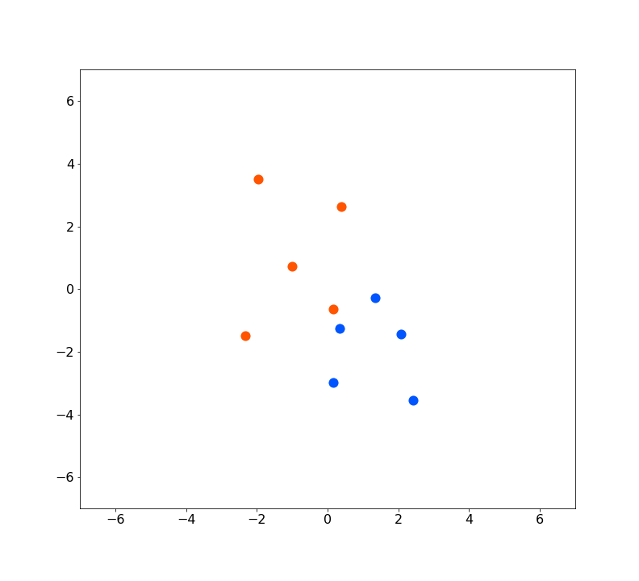
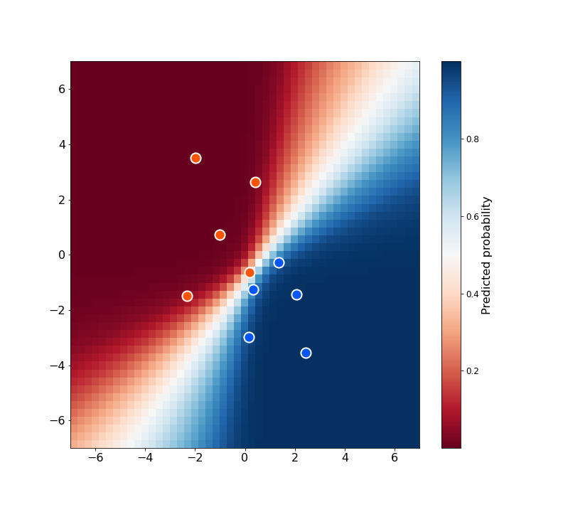

I'm a big fan of probabilistic modelling and Bayesian inference. In fact at the
time of writing that's the only topic I've written about on this blog so perhaps
that's _blindingly_ obvious... If you've ever dipped a toe into these warm
waters then you'll likely have come across Markov Chain Monte Carlo (MCMC)
algorithms. They are one of the workhorses of Bayesian inference, being an
efficient, general purpose way to draw samples from a probability distribution.
In this series of posts I want to develop some intution for MCMC algorithms by
implementing them and applying them to a toy problem. In this post we'll
understand the need for MCMC algorithms and learn about the Metropolis
algorithm, the original MCMC algorithm and the foundation for many more advanced
algorithms that were developed later. Let's get started!

## What problem are we solving?

If you've not really worked with MCMC algorithms before, it might not be
immediately obvious why we're so interested in drawing samples from a
probability distribution in the first place. To understand why, let's take a
step back and consider what problem we're actually trying to solve. Imagine we
have a probability distribution over $\theta$ - characterised by density
$p(\theta)$ - about which we want to answer certain questions.

Note that I'm (semi-)implicitly assuming $\theta$ to be modelled by a continuous
probability distribution here, so that we integrate over $\theta$ against
$p(\theta)d\theta$. This is primarily for notational convenience at this stage,
we could consider an arbitrary probability distribution characterised by
probability measure $P(\theta)$ in which case we can integrate directly against
$dP(\theta)$. In a later post, when we get on to the topic of Hamiltonian Monte
Carlo, we will need to make some continuity assumptions.

Essentially every quantity that we might be interested in to answer questions
about this distribution can be characterised in terms of integrals. An obvious
example would be the expected value of $\theta$

$$
    \mathbb E [\theta] = \int \theta p(\theta)d\theta
$$

and similarly variances or covariances are simply integrals also. Perhaps
slightly less obviously, event probabilities can also be characterised as
integrals, since they are the expected value of the
[indicator function](https://en.wikipedia.org/wiki/Indicator_function) of that
event

$$
    P(\theta \in A) = \mathbb E [\chi_A(\theta)] = \int_A p(\theta)d\theta
$$

If $\theta$ is scalar, quantiles such as the median can be characterised via
integrals

$$
    \mathrm{median}(\theta) := \sup\left\{x ~ \bigg| ~ \int_{-\infty}^x p(\theta)d\theta \leq 0.5 \right\}
$$

So the problem of doing inference on a probability distribution reduces to
evaluating integrals. What we would like is a general way to evaluate or
approximate these integrals.

When we first learn about integration, the focus is usually on evaluating
integrals analytically. In reality it isn't hard to construct examples where
this isn't possible, even in one dimension. If we want to evaluate a high
dimensional integral we often will have no choice but to numerically approximate
it. So what are our options?

## Approximating integrals

Many algorithms have been developed for approximating integrals, they can
broadly be split into two categories: deterministic and stochastic approaches.
We'll suppose that given some function $f(\theta)$ we want to evaluate

$$
    \int f(\theta)p(\theta)d\theta
$$

### Deterministic approaches

Deterministic approaches typically start with some kind of grid of points
$\theta_i$ for $i = 1, \dots, N$, then approximate the integral with a weighted
sum of evaluations of the integrand on the grid

$$
    \int f(\theta)p(\theta)d\theta \approx \sum_{i=1}^N w_i f(\theta_i) p(\theta_i)
$$

[Simpson's rule](https://en.wikipedia.org/wiki/Simpson's_rule) for example is a
particular special case of this, but there are many variants. There are two big
drawbacks to these deterministic approaches that mean we will ultimately be
uninterested in using them for inference:

1. If we were to use a naïve strategy for choosing grid points, then the number
   of points required to reach some acceptable level of error increases
   exponentially with the dimension of the space we are integrating over. For
   example, if we were using a uniform grid, then in one dimension we might
   require $N$ points for an acceptable level of error. In two dimensions, to
   achieve the same "resolution" we would need a grid of $N^2$ points, and so on
   so that in $d$ dimensions we construct a grid of $N^d$ points. Deterministic
   evaluation of integrals quickly becomes intractable as a result. There are of
   course algorithms that try to solve such problems, using adaptive grids and
   other tricks, but they will mostly be more complicated and less general.

2. A second problem, which is particularly relevant in Bayesian inference, is
   that we need to evaluate the density $p(\theta)$, whereas typically we might
   only know the density up to a multiplicative constant. We will see shortly
   that MCMC methods don't have this problem, as they can proceed with an
   unnormalised form of the density.

### The Monte Carlo approximation

The Monte Carlo approximation is a stochastic integral approximation. Given
samples $\theta_s$ for $s = 1, \dots, N$ we approximate

$$
    \int f(\theta)p(\theta)d\theta \approx \frac 1 N \sum_{s=1}^N f(\theta_s)
$$

that is we average evaluations of $f$ on the samples $\theta_s$. Note that
unlike the deterministic approaches above, the approximation does not feature
evaluations of $p$. This is instead accounted for by the fact that samples
$\theta_s$ will be concentrated where $p$ is large. As a result we can think of
the samples as being like an adaptive grid, which places more grid points in
regions that have more influence on the value of the integral.

From the
[Central Limit Theorem](https://en.wikipedia.org/wiki/Central_limit_theorem) we
can deduce that asymptotically as $N\rightarrow \infty$

$$
    \frac 1 N \sum_{s=1}^N f(\theta_s) \sim \mathcal N \left(\mathbb{E}_p(f(\theta)), \frac{\mathrm{var}_p(f(\theta))}{N}\right)
$$

from which we learn that the variance of the Monte Carlo estimator, or
specifically the asymptotics thereof, are _independent of the dimension of
$\theta$_! This remarkable fact is one of the key reasons that the Monte Carlo
estimator is so powerful when it comes to estimating high dimensional integrals.

## Drawing samples

It might seem like we just got a free lunch, which should make you suspicious.
How did we manage to get rid of the exponential scaling just by introducing some
stochasticity? In truth we didn't get rid of it, we've just traded one problem
for another. Rather than approximating integrals we need to figure out how to
draw independent samples from an arbitrary probability distribution. A naïve
approach will have the same exponential scaling with dimension as the
deterministic integral evaluation, so really we've just shifted the complexity
into the drawing of samples.

An interesting observation however, which opens the door to MCMC algorithms is
that the independence requirement can be relaxed. We can use correlated samples
instead, but the variance in the estimator will decay slower than $N^{-1/2}$. In
fact we can quantify the price we pay for not having independent samples. We
introduce $N_{eff}$, the effective sample size, defined as

$$
    N_{eff} := \frac{N}{1 + 2 \sum_{k=1}^\infty \rho_k}
$$

where $\rho_k$ are the lag-$k$ auto-correlations in the sample. It can be shown
that the variance in the estimator decays like $N_{eff}^{-1/2}$, and so in some
sense our $N$ correlated samples are "as good as" $N_{eff}$ independent samples.

Notice that the less correlated the samples, the larger $N_{eff}$, so when
drawing samples we want to find a balance of drawing as many samples as possible
(increasing $N$) with making sure that those samples are as uncorrelated as
possible (reducing the denominator). Both of these things will increase
$N_{eff}$, but they are likely to be in tension.

### Markov chains

A Markov chain is a sequence of random variables, where each variable depends
only on the previous variable. That is $\theta_1, \dots, \theta_k$ satisfies
$p(\theta_k ~ | ~ \theta_1, \dots, \theta_{k-1}) = p(\theta_k ~ | ~ \theta_{k-1})$.
As a result, Markov chains can be characterised by transition kernel
$T(\theta_k | \theta_{k-1})$, which represents the probability of transitioning
from $\theta_{k-1}$ to $\theta_k$ in one step.

A classic example is that of a random walk, where
$\theta_k = \theta_{k-1} + \varepsilon_k$. That is, at each time step we take a
step in the direction $\varepsilon_k$ which is drawn from some appropriate
probability distribution like a multivariate normal distribution.

Markov chains have some nice convergence properties assuming certain conditions
are satisfied. There's a lot of theory behind these results that I won't go into
in detail in this post. The key thing to know is that under certain regularity
conditions, the chain will have a so-called _stationary distribution_. The
stationary distribution is unique, and invariant under the transition kernel.
That means if we sample a starting point from the stationary distribution, then
take a step according to the transition kernel, the result is also distributed
according to the stationary distribution. Furthermore we have that the Markov
chain will converge to that stationary distribution from any starting position.

The practical implication therefore is that if we can construct a Markov chain
whose stationary distribution is the target distribution, then we know that
samples from the chain will look more and more like samples from the target
distribution if we evolve the chain for long enough. This is precisely what the
Metropolis algorithm does.

### The Metropolis algorithm

We want to construct a Markov chain whose stationary distribution is the target
distribution. To do so we need two ingredients:

1. The target probability distribution $p(\theta)$ (which need not be
   normalised)
2. A jumping / proposal distribution $J(\theta_{t+1} ~ | ~ \theta_t)$, which
   given the current location in parameter space $\theta_t$, defines a
   probability distribution over possible locations at the next time step. The
   Metropolis algorithm requires that this proposal distribution is symmetric so
   that $J(\theta ~ | ~ \hat \theta) = J(\hat \theta ~ | ~ \theta)$, i.e. the
   probability of jumping from A to B is the same as the probability of jumping
   from B back to A. This requirement can be relaxed.

The idea of the algorithm is to evolve the Markov chain by sampling a proposal
from the proposal distribution, then applying an accept / reject criterion based
on the target distribution that will ensure the chain as a whole has the correct
stationary distribution. It is worth understanding this setup well, as many more
advanced algorithms follow the same structure, they just use clever choices of
$J$.

The details are as follows:

1. Choose a starting point $\theta_0$.
2. Given $\theta_t$, sample $\theta^*$ from the proposal distribution
   $J(\theta^* ~ | ~ \theta_t)$.
3. Sample $r \sim \mathrm{Unif}(0, 1)$. If $r < p(\theta^*) / p(\theta_t)$, set
   $\theta_{t+1} = \theta^*$, otherwise set $\theta_{t+1} = \theta_t$.
4. Repeat $N$ times.

The ratio $p(\theta^*) / p(\theta_t)$ represents how much more likely the
proposal $\theta^*$ is under the target distribution than the current sample
$\theta_t$. If the proposal is in a region of higher density than the current
sample it will always be accepted (because $r \leq 1$), otherwise if the
proposal would take the chain to a region of lower probability (under the target
distribution), there is a non-zero chance the proposal is rejected and the chain
stays where it is. A proof that this procedure results in the target
distribution being the stationary distribution is included in the appendix at
the end of this post.

Notice that because the target distribution only enters the algorithm in the
form of this ratio, it is ok if we only know the target distribution up to a
multiplicative constant independent of $\theta$, as such constants will cancel
out anyway. This is exactly the situation we find ourselves in when doing
Bayesian inference. It's easy to specify the unnormalised prior as the product
of the prior and the likelihood

$$
    p(\theta | y) = \frac{p(\theta)p(y | \theta)}{p(y)} \propto p(\theta)p(y | \theta)
$$

Ordinarily the data marginal / evidence in the denominator is hard to calculate
(it is itself defined in terms of an integral over $\theta$), but thanks to the
Metropolis algorithm we needn't calculate it and can instead just work with the
unnormalised product.

## Implementing Metropolis

Let's have a go at implementing the Metropolis algorithm. To do so we'll need to
specify a proposal distribution $J$ which we haven't discussed yet. One of the
simplest, and perhaps most common, choices is a normal distribution

$$
    \theta^* | \theta_t \sim \mathcal{N}(\theta_t, \sigma^2)
$$

where $\sigma$ is a tunable parameter. That is to say, at each step the proposal
is simply the current sample with some normally distributed noise applied. This
is very easy to implement, and is known as Random Walk Metropolis, as the
proposal distribution is defining a random walk in parameter space.

Below is a simple implementation of the metropolis algorithm. It expects an
unnormalised density `target` corresponding to the target distribution, a
function `initial` that can produce an initial sample, and a proposal
distribution `proposal` that returns a sampled proposal given the current point.
The implementation could certainly be improved, I'm attempting to optimise for
clarity rather than anything else.

```python
import numpy as np


def metropolis(target, initial, proposal, iterations=100_000):
    samples = [initial()]

    for _ in range(iterations):
        current = samples[-1]
        proposed = proposal(current)
        if np.random.random() < target(proposed) / target(current):
            samples.append(proposed)
        else:
            samples.append(current)

    return samples
```

You'll notice that the core logic of this algorithm is really very simple.
Abstracting away the proposal it's only a handful of lines of code. Don't be
fooled by the simplicity though, this basic structure can be extremely powerful.

Let's implement a proposal distribution. This can quite neatly be encapsulated
with a custom class which we make callable by implementing the `__call__` magic
method.

```python
class NormalProposal:
    def __init__(self, scale):
        self.scale = scale

    def __call__(self, sample):
        jump = np.random.normal(
            scale=self.scale, size=sample.shape
        )
        return sample + jump
```

Instantiating `NormalProposal` produces a callable object that adds normally
distributed noise with the specified scale to the argument.

We also need a target distribution to sample from. Let's start simple and use a
multivariate normal distribution. Again, this can be quite neatly implemented as
a callable object.

```python
class MultivariateNormalPDF:
    def __init__(self, mean, variance):
        self.mean = mean
        self.variance = variance
        self.inv_variance = np.linalg.inv(self.variance)

    def __call__(self, sample):
        return np.exp(
            -0.5
            * (sample - self.mean).T
            @ self.inv_variance
            @ (sample - self.mean)
        )
```

Notice that this object returns an unnormalised form of the density, ordinarily
there would be an additional factor depending on the determinant of the
covariance matrix.

We can put this all together and draw samples

```python
samples = metropolis(
    target=target,
    initial=lambda: np.array([0, 0]),
    proposal=NormalProposal(0.1),
    iterations=50_000,
)
```

I ran this four times with different starting points each time. The results are
shown below

<p align="center">
  <div class="gif-container">
    
  </div>
</p>

You can see from the animation that the early samples, when the chain is still
finding its way to the high density region of the target distribution are not
very representative of the target, however once the chains have found their way
to the high density region they explore it fully and mix well.

Understanding when the chain has converged is one of the challenges of MCMC.
Various diagnostic metrics have been introduced which I won't go into here. One
basic idea that suggests itself when you look at the animation above is to run
multiple chains and compare them after some samples have elapsed. In the simple
example, the chains quickly become indistinguishable, suggesting (but not
proving) that they have converged to the shared target. The $\hat R$ metric
provides a more rigourous quantification of this observation than the "eyeball
metric" that we used.

## Fitting Logistic regression with the Metropolis algorithm

Sampling from a normal distribution is a little underwhelming. Let's finish up
this post by trying something a bit more interesting. Let's generate some simple
data for classification.

```python
def sigmoid(arr):
    return 1 / (1 + np.exp(-arr))


alpha = -1.5
beta = np.array([1.5, -1.6])

data = np.random.multivariate_normal(
    np.zeros(2), np.array([[4, -2], [-2, 4]]), size=10
)
labels = np.random.binomial(1, p=sigmoid(data @ beta + alpha))
```

This gives us ten data points with five belonging to each class

<p align="center">
  
</p>

Let's see if we can separate them with a logistic regression model. A standard
setup would be something like the following

$$
    \alpha \sim \mathcal{N}(0, 5^2) \\
    \beta_i \sim \mathcal{N}(0, 5^2) \\
    y_i \sim \mathrm{Bernoulli}\left(\frac{1}{1 + \exp(-(\alpha + \beta^T x_i))}\right)
$$

We want to sample from $p(\alpha, \beta | \mathbf y, \mathbf x)$. Let

$$
    \eta_i = \frac{1}{1 + \exp(-(\alpha + \beta^T x_i))}
$$

By Bayes rule we have

$$
    p(\alpha, \beta | \mathbf y, \mathbf x) \propto \exp\left( \frac{-\alpha^2 - \|\beta\|^2}{50} \right) \prod_i \eta_i^{y_i} (1 - \eta_i)^{1 - y_i}
$$

That looks easy enough to implement, so let's try it!

```python
class LogisticPDF:
    def __init__(self, x, y, prior_scale=5):
        self.x = x
        self.y = y
        self.prior_scale = prior_scale

    @staticmethod
    def _likelihood(x, y, alpha, beta):
        eta = 1 / (1 + np.exp(-(alpha + np.dot(beta, x))))
        if y == 1:
            return eta
        return (1 - eta)


    def __call__(self, sample):
        alpha, beta = sample
        prior = np.exp(
            -(alpha ** 2 + np.linalg.norm(beta) ** 2) / (2 * self.prior_scale ** 2)
        )

        likelihood = 1
        for x, y in zip(self.x, self.y):
            likelihood *= self._likelihood(x, y, alpha, beta)

        return prior * likelihood
```

The way I've written this, each sample is a tuple consisting of an $\alpha$
sample and a $\beta$ sample, so we also need to slightly rewrite the normal
proposal from before.

```python
class NormalProposalLogistic:
    def __init__(self, scale):
        self.scale = scale

    def __call__(self, sample):
        alpha, beta = sample
        alpha_jump = np.random.normal(
            scale=self.scale, size=alpha.shape
        )
        beta_jump = np.random.normal(
            scale=self.scale, size=beta.shape
        )
        return alpha + alpha_jump, beta + beta_jump
```

That's it, we can use the same `metropolis` function from before to draw samples

```python
target = LogisticPDF(data, labels)
proposal = NormalProposalLogistic(0.1)
samples = metropolis(target, lambda: (np.array(0), np.array([0, 0])), proposal)
```

This gives us many samples of the coefficients in the model. The posterior
predictive distribution is given by averaging the sampling distribution against
the posterior.

$$
    p(\tilde y | \tilde x, x, y) = \int p(\tilde y | \tilde x, \alpha, \beta)p(\alpha, \beta | x, y) d(\alpha, \beta)
$$

In practice this means making a prediction with each sampled set of coefficients
and then averaging the predictions. The result of doing this in our case
(discarding the first 10,000 samples to minimise bias from the initialisation)
is shown below.

<p align="center">
  
</p>

There we have it, a simple logistic regression solved by MCMC. From the heatmap
you can see there is some uncertainty in the decision boundary, a consequence of
the range of plausible parameters that could have given rise to the observed
data. This is just one example of the benefits of inferring a distribution over
parameters rather that simply a point estimate.

You'll notice that it was pretty easy to separate concerns in our implementation
of Metropolis. Once the core logic was in place (the `metropolis` function) we
were able to draw samples from a couple of different distributions just by
implementing a target density and a proposal distribution. The fact that we
don't have to normalise the target distribution helped make this very easy for
us. In the first example it would have been easy enough to implement a correctly
normalised multivariate normal density, but in the case of the logistic
regression it would have been at the very least annoying to do analytically. For
more complex models it's often impossible.

## Conclusion

In this post we learned that statistical inference boils down to evaluating
(often analytically intractable) integrals. We saw that the Monte Carlo
estimator is a powerful stochastic integral approximator, which means to
approximate integrals we can draw samples instead. Though drawing independent
samples can be challenging, we learnt that correlated samples will do just fine,
as long as we account for the amount of correlation in the sample when making
inferences. The Metropolis algorithm is a general algorithm for sampling from
any target distribution by constructing a Markov chain whose stationary
distribution is the target distribution. We implemented the Metropolis algorithm
and used it to sample from a multi-variate normal distribution, and to solve a
simple logistic regression problem.

In the next post in this series, we're going to take a look at Hamiltonian Monte
Carlo, which uses the geometry of the target distribution to construct a very
efficient proposal distribution. We'll learn how it works and then try
implementing it like we did here.

Full code for all of the plots and animations in this post is available
[here](https://gist.github.com/tcbegley/e7b1f22a5d3fffed35d3f1dbffc8daf3).

## Appendix - stationarity of the target distribution

We show that the target distribution satisfies
[detailed balance](https://en.wikipedia.org/wiki/Detailed_balance#Reversible_Markov_chains)
with respect to the transition kernel induced by the Metropolis algorithm.
Specifically, we want to show for any $\theta_a$ and $\theta_b$ we have

$$
    p(\theta_a)T(\theta_b | \theta_a) = p(\theta_b)T(\theta_a | \theta_b)
$$

where $T$ is the transition kernel. Note that the transition kernel incorporates
the accept / reject step and is _not_ the same as the proposal distribution.

To prove this let's pick arbitrary $\theta_a$ and $\theta_b$. Suppose
$p(\theta_a) > p(\theta_b)$, which we may do without loss of generality. Then
the proposal $\theta_a$ will always be accepted from state $\theta_b$ so
$T(\theta_a | \theta_b) = J(\theta_a | \theta_b)$ and hence

$$
    p(\theta_b)T(\theta_a | \theta_b) = p(\theta_b)J(\theta_a | \theta_b)
$$

Going in the other direction, the proposal $\theta_b$ is accepted from state
$\theta_a$ with probability $p(\theta_b) / p(\theta_a)$, so using the fact that
the proposal distribution is assumed to be symmetric

$$
    p(\theta_a)T(\theta_b | \theta_a) = p(\theta_a) J(\theta_b | \theta_a) \frac{p(\theta_b)}{p(\theta_a)} = p(\theta_b)J(\theta_a | \theta_b)
$$

from which detailed balance follows, and hence the fact that $p$ is the
stationary distribution of the Markov chain.
