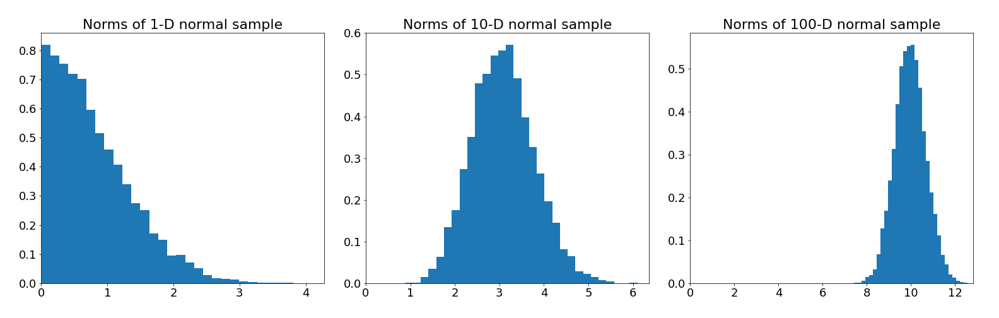
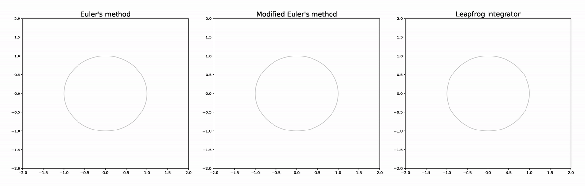
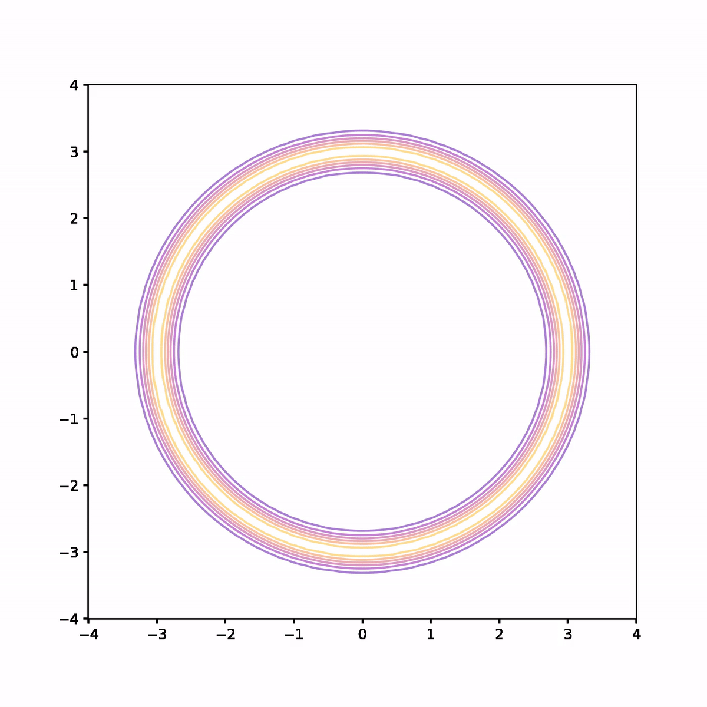

This post is about Hamiltonian Monte Carlo, an MCMC algorithm that builds on the
Metropolis algorithm, but uses information about the geometry of the posterior
to make better proposals. If you are unfamiliar with the Metropolis algorithm,
check out the [previous post in this series](/blog/mcmc-1). We'll start by
understanding how the algorithm works, what problems it solves, then finish up
with a simple implementation.

If you would like to know more about Hamiltonian Monte Carlo I strongly
recommend
[A Conceptual Introduction to Hamiltonian Monte Carlo](https://arxiv.org/pdf/1701.02434.pdf)
by Michael Betancourt, from which I learnt many of the things I'm writing about
here.

## The need for better proposals

In the previous post we successfully applied the Random Walk Metropolis
algorithm to a couple of different problems. Generating a proposal by adding
normally distributed noise to the current location is very simple and easy to
implement, so why would we want to do anything else?

To understand the answer, recall that MCMC algorithms return a sample, of size
$N$ say, from the target distribution. This sample is correlated, which
motivates the introduction of the _effective sample size_ $N_{eff}$. The error
in the Monte Carlo estimator decreases like $N_{eff}^{-1/2}$, so we can
interpret our correlated sample as having the utility of an independent sample
of size $N_{eff}$. The goal therefore is to maximise the effective size with the
available resources (time and compute). There are two ways to increase
$N_{eff}$:

1. We can increase the total number of samples, or
2. We can decrease the correlation in the samples.

These two possibilities are somewhat in tension. Decreasing the correlation in
the samples probably means doing more work per sample which means producing
fewer samples in total. On the other, simple fast methods for generating
proposals might result in high correlation, but allow for large samples to be
produced because they can be run so quickly.

The Random Walk Metropolis algorithm falls into the latter category here.
Sampling from a normal distribution to generate the proposal is fast, but it
turns out will lead to correlated samples. The following example illustrates why
this is the case. Consider this (unnormalised) probability density, that is
concentrated in an annular region.

```python
import numpy as np


class DonutPDF:
    def __init__(self, radius=3, sigma2=0.05):
        self.radius = radius
        self.sigma2 = sigma2

    def __call__(self, x):
        r = np.linalg.norm(x)
        return np.exp(-(r - self.radius) ** 2 / self.sigma2)
```

Let's reuse the implementation of Random Walk Metropolis from the last post and
use it to draw samples from this density. First recall the proposal distribution
which simply adds normally distributed noise to the previous sample

```python
class NormalProposal:
    def __init__(self, scale):
        self.scale = scale

    def __call__(self, sample):
        jump = np.random.normal(
            scale=self.scale, size=sample.shape
        )
        return sample + jump
```

We combine this with the Metropolis algorithm which generates proposals and
applies an accept / reject criterion based on the target density

```python
def metropolis(target, initial, proposal, iterations=10_000):
    samples = [initial()]

    for _ in range(iterations):
        current = samples[-1]
        proposed = proposal(current)
        if np.random.random() < target(proposed) / target(current):
            samples.append(proposed)
        else:
            samples.append(current)

    return samples
```

We'll run two simulations with different scales in the proposal distribution.

```python
target = DonutPDF()
samples05 = metropolis(target, lambda: np.array([3, 0]), NormalProposal(0.05))
samples1 = metropolis(target, lambda: np.array([3, 0]), NormalProposal(1))
```

We can see what's going on by animating the samplers. The underlying contour
plot shows the target density

<p align="center">
  <div class="gif-container">
    
  </div>
</p>

Using both small and large jumps to generate proposals results in highly
correlated samples. In the former case, each proposal is not very different from
the previous sample so progress through parameter space is slow. In the latter
case, there is a high probability the jump lands us outside the annular region
where the probability density is vanishingly small, which means there is a high
probability that sample is rejected. When a sample is rejected the previous
sample is repeated, which results in high correlation in the samples, and hence
small $N_{eff}$.

Furthermore, we haven't fully explored the target density. Neither sample makes
it all of the way around the annulus, and both end up having their samples
concentrated in a small sector.

What we ideally would like is a method for generating proposals that would
result in less correlation in the samples, and better exploration of the target
density. This is where Hamiltonian Monte Carlo comes in. But before we look at
how it works, I want to quickly argue that this annular density example isn't
completely contrived.

Consider a standard multivariate normal distribution $X \sim \mathcal N(0, I)$.
This is arguably the simplest high-dimensional probability distribution we might
like to sample from. Let's look at how the distribution of distance to the
origin in a sample changes as we increase the dimension.

<p align="center">
  
</p>

What we see from the histograms is that as the dimension increases, the samples
become concentrated in an annular region further and further from the origin.
Why does this happen? Well, remember that event probabilities are defined by
integration

$$
    P(\theta \in A) = \int_A p(\theta)d\theta
$$

So the probability that a sample will land in region $A$ depends _both_ on the
density $p(\theta)$ in that region, but also the volume of that region
$d\theta$. Mass, including probability mass, depends on both density and volume.

The normal density is always largest at the origin in any dimension, but in
higher dimensions there is much more volume away from the origin than there is
near the origin, which means the product of $p(\theta)$ and $d\theta$ is
maximised in the annular region. High dimensional spaces are weird...

The practical implication of this trade-off between volume and density, is that
in high dimensions most of the probability mass is concentrated along narrow
submanifolds, which are easy to fall off if we generate proposals with a random
walk. To ensure the Markov Chain remains in the high probability mass region we
need to use information about the density in our proposal distribution.

## Hamiltonian Monte Carlo

Hamiltonian Monte Carlo uses ideas from
[Hamiltonian mechanics](https://en.wikipedia.org/wiki/Hamiltonian_mechanics) to
generate a proposal by moving through parameter space according to a carefully
constructed Hamiltonian system.

Here's some not terribly rigorous intuition. Imagine the graph of the negative
log target density over parameter space. The high density regions of the target
correspond to "wells" and "valleys" on this surface. Now imagine a particle
released on the surface. It will roll "downhill" into the high density regions.
If instead of simply releasing the particle we were to give it an initial push
in a randomly chosen direction, it will roll around the surface, always being
attracted towards high density regions, but sometimes having enough momentum
that it rolls out into a lower density region, only to eventually slow down and
return to the high density regions. If we construct the path that this imaginary
particle would take, we can follow the path for a fixed amount of time, and then
use the place we end up as the proposal in the Metropolis algorithm. That is, in
essence, the Hamiltonian Monte Carlo algorithm.

Let's try and make that slightly more rigorous. I'm going to change notation
here to be consistent with the standard notation in Hamiltonian mechanics. We'll
denote by $q$ the parameters, which take the role of generalised coordinates in
the Hamiltonian system, $\pi(q)$ the target distribution, and $p$ the conjugate
momenta. Together, $(q, p)$ defines _phase space_, expanding the $d$-dimensional
parameter space into a $2d$-dimensional space.

We will contstruct a Markov chain in phase space. To do so, we need to introduce
a probability distribution $\pi(q, p)$ over phase space. Since we ultimately
want to recover a sample from the original target distribution $\pi(q)$, it's
important that the marginal distribution of $\pi(q, p)$ over $q$ is simply
$\pi(q)$. For this reason we define the distribution over phase space by
specifying the conditional distribution of $p$ given $q$

$$
    \pi(q, p) = \pi(q)\pi(p | q)
$$

which guarantees that $\pi(q)$ is indeed the marginal distribution. We define
the Hamiltonian as

$$
    H(q, p) = -\log \pi(q, p) = -\log \pi(q) - \log \pi(p | q)
$$

which decomposes into two terms:

1. The first, $-\log\pi(q)$, is the negative log target density and can be
   thought of as the "potential energy" in the system. In the hand-wavey
   geometric picture from before, it is the height of the particle on the
   surface. As the particle rolls down into higher density regions this term
   decreases.
2. The second, $-\log \pi(p|q)$, can be thought of as kinetic energy. Unlike the
   first term which is determined by the target, we have full freedom to choose
   the form of this term.

A common choice for $\pi(p | q)$ is a multivariate normal distribution

$$
    \pi(p | q) = \mathcal{N}(p | 0, M)
$$

where $M$ is known as the mass-matrix. We have freedom to choose an arbitrary
$M$, so we would ideally make a choice that makes sampling as easy as possible.
As it turns out, setting $M$ to be the inverse of the covariance matrix of the
_parameters_ is equivalent to transforming parameter space in order to maximally
decorrelate the parameters, which helps sampling. Hence we set

$$
    M^{-1} := \mathbb{E}_\pi [(q - \mathbb{E}(q))(q - \mathbb{E}(q))^T]
$$

Of course, this quantity is not generally known as $\pi(q)$ is unknown. In
practice, this covariance matrix is estimated from the samples in a warm-up
phase, and the mass matrix is then updated for later samples. With $M$
estimated, we have

$$
    -\log \pi(p | q) = \frac 1 2 p^T M^{-1} p + \log |M| + const
$$

Since we are able to work with unnormalised densities, we can drop constants
that are independent of $q$ and $p$.

### Evolving the Hamiltonian system

Hamilton's equations tell us how the system evolves in phase space. We have

$$
    \frac{d q}{d t} = \frac{\partial H}{\partial p} \\
    \frac{d p}{d t} = -\frac{\partial H}{\partial q}
$$

Given a sample $q^{(i)}$ (I'm switching to indexing samples with $i$ to avoid a
notation clash with the time evolution of the Hamiltonian system), we set
$q_0 = q^{(i)}$ and sample $p_0 \sim \mathcal{N}(0, M)$, we then evolve
$(q_0, p_0)$ for a fixed time $T$ to obtain a proposal $(q_T, p_T)$, which we
apply the standard Metropolis acceptance criterion to. If we accept then we have
$q^{(i+1)} = q_T$, otherwise we stay where we are and set $q^{(i+1)} = q^{(i)}$.

So how do we obtain $q_T$? We need to numerically solve the system. Many
numerical solvers suffer from errors that compound over time, meaning that our
estimate of $q_T$ gets worse as $T$ gets large. Fortunately, we can exploit the
structure of the Hamiltonian system. The Hamiltonian itself is constant along
flow lines, which we can easily verify by differentiating with respect to time
and substituting Hamilton's equations

$$
    \frac{d}{d t}H(q, p) = \frac{\partial H}{\partial q}\frac{d q}{d t} + \frac{\partial H}{\partial p}\frac{d p}{d t} = 0
$$

In other words, the flow is along level sets of the Hamiltonian. A certain class
of numerical approximation schemes, known as _symplectic integrators_ preserve
the value of the Hamiltonian along the approximate solution, which limits the
extent to which errors can accumulate. In particular errors do not compound,
which allows us to flow for longer without the error becoming unacceptably
large.

A simple and often used symplectic integrator is the so called leapfrog
integrator. This sees us make a half step with $p$, using the half-updated $p$
to update $q$, then taking another half step with $p$ using the updated $q$. In
other words

$$
    \tilde p = p_n - \frac{\varepsilon}{2} \frac{\partial H}{\partial q}(q_n, p_n) \\
    q_{n+1} = q_n + \varepsilon \frac{\partial H}{\partial p}(q_n, \tilde p) \\
    p_{n+1} = \tilde p - \frac{\varepsilon}{2} \frac{\partial H}{\partial q}(q_{n+1}, \tilde p)
$$

We can test this with an extremely simple Hamiltonian

$$
    H(q, p) = \frac{q^2 + p^2}{2}
$$

The figure below compares the leapfrog approximator to Euler's method and a
modified Euler's method (see the appendix at the end of this post for details).
The analytic solution is shown in grey. We see that Euler's method diverges
completely, while the modified Euler doesn't diverge, but does deviate from the
analytic solution at times, while the leapfrog integrator is very faithful to
the analytic solution.

<p align="center">
  <div class="gif-container">
    
  </div>
</p>

## Implementing Hamiltonian Monte Carlo

We have everything we need to implement Hamiltonian Monte Carlo. The algorithm
is as follows:

1. Choose a starting point $q^{(0)}$ in parameter space, and fix a step size
   $\varepsilon$ and a path length $L$.
2. Given parameters $q^{(n)}$ we sample $p^{(n)} \sim \mathcal N(0, I)$. More
   generally we could sample from $\mathcal{N}(0, M)$ where
   $M \approx \mathrm{cov}(q)$. We will however keep things simple and just use
   the identity matrix.
3. We set $(q_0, p_0) = (q^{(n)}, p^{(n)})$. Evolve $(q_0, p_0)$ for $L$ steps
   using the leapfrog integrator to obtain $(q_L, p_L)$, an approximation of
   $(q(\varepsilon L), p(\varepsilon L))$.
4. Sample $r \sim \mathrm{Unif}(0, 1)$ and let $q^{(n+1)} = q_L$ if
   $\pi(q_L, p_L) / \pi(q^{(n)}, p^{(n)}) < r$, or $q^{(n+1)} = q^{(n)}$
   otherwise.
5. Repeat

Ok, here goes. First the leapfrog integrator. As before, all implementations are
optimised for clarity and simplicity rather than performance.

```python
def leapfrog(q0, p0, target, L, step_size):
    q = q0.copy()
    p = p0.copy()

    for i in range(L):
        p += target.grad_log_density(q) * step_size / 2
        q += p * step_size
        p += target.grad_log_density(q) * step_size / 2

    return q, p
```

We then use that to generate proposals in the Metropolis algorithm. Note we
slightly modify the implementation of Metropolis from before since we must
compare ratios of the joint distribution over parameters and momenta rather than
the target distribution.

```python
def hmc(target, initial, iterations=10_000, L=50, step_size=0.1):
    samples = [initial()]

    for _ in range(iterations):
        q0 = samples[-1]
        p0 = np.random.standard_normal(size=q0.size)

        qL, pL = leapfrog(q0, p0, target, L, step_size)

        h0 = -target.log_density(q0) + (p0 * p0).sum() / 2
        h = -target.log_density(qL) + (pL * pL).sum() / 2
        log_accept_ratio = h0 - h

        if np.random.random() < np.exp(log_accept_ratio):
            samples.append(qL)
        else:
            samples.append(q0)

    return samples
```

We also slightly redesign the target, as we require evaluations of the gradient
of the log density of the target. In this example I've hard-coded the gradient,
but proper implementations typically use some form of autodiff to calculate
gradients.

```python
class DonutPDF:
    def __init__(self, radius=3, sigma2=0.05):
        self.radius = radius
        self.sigma2 = sigma2

    def log_density(self, x):
        r = np.linalg.norm(x)
        return -(r - self.radius) ** 2 / self.sigma2

    def grad_log_density(self, x):
        r = np.linalg.norm(x)
        if r == 0:
            return np.zeros_like(x)
        return 2 * x * (self.radius / r - 1) / self.sigma2
```

We can then draw samples

```python
hmc_samples = hmc(DonutPDF(), lambda: np.array([3, 0.]));
```

The below animation shows what's going on. On each iteration we compute the
trajectory according to the Hamiltonian system, then after a fixed time we stop
and use the end point as a proposal in the Metropolis algorithm. In the
animation, the trajectory flashes green or red depending on whether the proposal
is accepted or rejected respectively.

<p align="center">
  <div class="gif-container">
    
  </div>
</p>

We see that not only is the acceptance rate very high, but also the Markov chain
quickly finds its way around the donut and covers parameter space quite evenly.
The combination of a high acceptance rate and the potential to take large steps
will result in a low auto-correlation and hence higher effective sample size.

Of course, calculating the trajectories of the Hamiltonian system at each time
step is significantly more computationally expensive than generating a proposal
by adding normally distributed noise. However, in practice it often turns out
that the decrease in auto-correlation in the samples far outweighs the reduction
in the number of samples, so we still get a better effective sample size which
is a much better measure of the quality of our sample than the raw sample size.

Let's finish up by comparing the two Random Walk Metropolis algorithms with
different scales from earlier to Hamiltonian Monte Carlo.

<p align="center">
  <div class="gif-container">
    
  </div>
</p>

Even for this simple example the results are pretty striking. Random Walk
Metropolis with small jumps makes small and limited progress around the donut in
the first 1000 samples. With a larger jump size it manages to make it all the
way round, but the acceptance rate is low and the samples are not very evenly
spread. Finally Hamiltonian Monte Carlo achieves an extremely high acceptance
rate and has very good coverage of the distribution. Even without calculating
anything it's pretty clear that the sample from Hamiltonian Monte Carlo is the
highest quality of the three.

## Summary

The effective sample size is a good measure of the quality of a sample from a
MCMC sampler. We can increase the effective sample size by either drawing more
samples, or decreasing the auto-correlation in the samples. Random-Walk
Metropolis which we saw in the first post is able to draw a large number of
samples very quickly, but struggles to make good proposals as the dimension of
parameter space increases: either it moves through parameter space very slowly
or the proposals have a low acceptance rate. In either case the auto-correlation
in the sample is high.

Hamiltonian Monte Carlo defines flows through parameter space along which the
sampler travels to generate new proposals. This means the sampler can step
further away from the previous sample while retaining a high acceptance
probability. Each sample is more computationally expensive as a result, but we
frequently see enough of a reduction in the auto-correlation in the sample for
the trade-off to be worthwhile.

One thing we didn't discuss was how to choose the integration time $T$, or
equivalently in the approximation the step size $\varepsilon$ and the number of
steps $L$. If we choose $\varepsilon$ to be too large we might incur
unacceptably large error, but too small and the exploration of parameter space
will be very slow. Similarly if $L$ is too small we won't move very far through
parameter space, but too large and we incur a large computational cost computing
the flow, some of which may be wasted if the sampler covers old ground (imagine
in the donut picture we do multiple laps before making a proposal).

There is no general combination of $\varepsilon$ and $L$ that will work for all
problems, because what a suitable value is depends on the target. Even worse,
Hamiltonian Monte Carlo has been found to be quite sensitive to these parameter
choices, and a bad choice can destroy the utility of the sampler. In the next
post we will look at the No U-Turn Sampler (NUTS), a modification of Hamiltonian
Monte Carlo that is able to choose appropriate $\varepsilon$ and $L$
automatically, making it much easier to apply in practice.

Full code for all of the plots and animations in this post is available
[here](https://gist.github.com/tcbegley/a209773e77ae90e25ba570aab88afad5).

## Appendix

When introducing the leapfrog integrator we compared to two other approximation
schemes, the details of which are as follows. First Euler's method. Given a step
size $\varepsilon$ we produce sequences of approximations
$q_n \approx q(n\varepsilon)$ and $p_n \approx p(n\varepsilon)$ via the
recurrence relations

$$
    q_{n+1} = q_n + \varepsilon \frac{\partial H}{\partial p}(q_n, p_n) \\
    p_{n+1} = p_n - \varepsilon \frac{\partial H}{\partial q}(q_n, p_n)
$$

As we saw this method can accumulate error leading to divergence. A modification
to Euler's method sees us instead update $p$ using the updated value $q_{n+1}$

$$
    q_{n+1} = q_n + \varepsilon \frac{\partial H}{\partial p}(q_n, p_n) \\
    p_{n+1} = p_n - \varepsilon \frac{\partial H}{\partial q}(\mathbf{q_{n+1}}, p_n)
$$

This is more stable, but still prone to errors. The leapfrog integrator takes
this one step further and partially updates $p$, uses the partial update to
update $q$, then completes the update of $p$ with the updated $q$.
