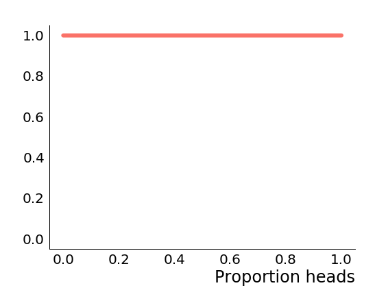
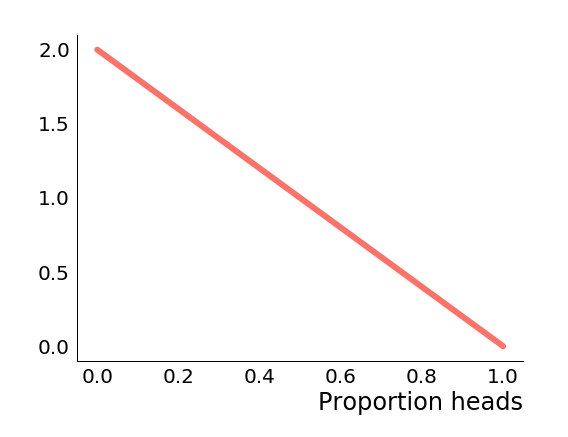
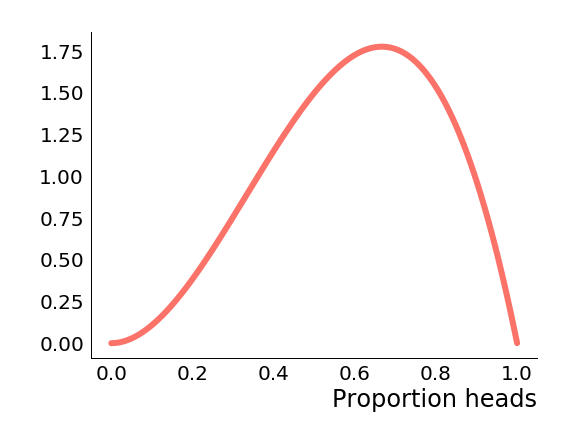
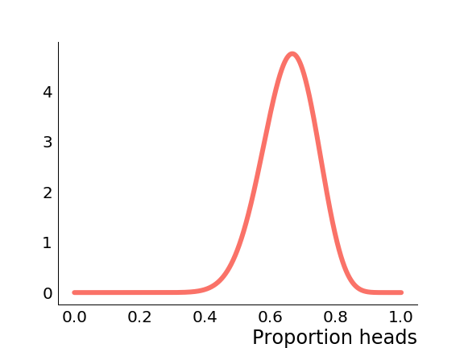
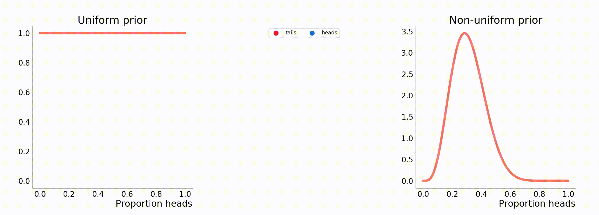

This is the second post in a series on election modelling; specifically multi-level regression with poststratification (MRP) and its successful use by YouGov in the 2017 general election.

In this post we are going cover technical preliminaries for understanding MRP. In particular we need to know a few things about Bayesian statistics, and computational inference.

## Bayesian statistics

Bayesian statistics differs from the more common frequentist approach in a subtle way that has far reaching consequences. It comes down to a different interpretation of probabilities. Specifically Bayesians interpret probability as quantifying the state of our knowledge, whereas frequentists interpret probability as frequencies of particular outcomes in repeated trials.

Under a Bayesian interpretation of probability, it makes sense to make probabilistic statements about fixed, unknown quantities such as model parameters; the probability quantifies our knowledge about the parameter.

Under a frequentist interpretation on the other hand it does not make sense, since parameters are assumed fixed we can't repeat trials / experiments and calculate frequencies. These blog posts make no attempt to resolve the (at times passionate) dispute between these two schools of thought, we're just interested in learning the basics of the Bayesian approach.

Because we are able to make probabilistic statements about model parameters when we have our Bayesian hats on, we can formulate and work with a joint probability model for data and parameters. The recipe for doing this comes from Bayes' theorem. Let's denote by $\theta$ model parameters, and $y$ data. Then

$$
    p(\theta | y) = \frac{p(y|\theta)p(\theta)}{p(y)} \propto p(y | \theta) p(\theta)
$$

Let's look at each term individually:

* $p(\theta \vert y)$ is called the _posterior distribution_. It is the distribution of model parameters conditioned on the data, and as such represents what we know about the model parameters having observed the data $y$. This is what we want to calculate so that we may do inference.
* $p(y \vert \theta)$ is called the _sampling distribution_ when viewed as a distribution over $y$, or the _likelihood_ when viewed as a function of $\theta$. It describes how data is generated given fixed model parameters.
* $p(\theta)$ is called the _prior distribution_. It is the distribution of model parameters in the absence of any other information about $y$. It represents what we know about the model parameters before having observed any data.
* $p(y)$ is known as the _evidence_ or _data marginal_. We typically don't worry about it so much because it can be recovered by integrating the right hand side with respect to $\theta$, and is just a normalising constant.

The Bayesian workflow proceeds as follows: we specify a joint probability distribution on our data and parameters by specifying a prior and a sampling distribution. We then condition on the data to get the posterior, and use that to make inferences about the parameters. We can then test our inferences and repeat the process to refine our model.

## Example: coin flipping

This can all be a little bit confusing if you've not seen it before, so it's useful to work through a concrete example. Let's imagine we have a coin, which is not necessarily fair, and we want to infer the probability that the coin shows heads when flipped. We'll collect data by repeatedly flipping the coin. Let's denote by $n$ the number of coin flips, $y$ the the number of heads, and $\theta$ the probability of getting heads on a single flip.

The first thing we need to do is specify a joint probability distribution over data and parameters via the prior and sampling distributions. The sampling distribution is relatively straightforward. Recall it describes how the outcome of the coin flip $y$ is generated given the parameter $\theta$. In this case $y$ should count the number of "successful" outcomes (i.e. flips where we get heads) in $n$ independent flips where there is a fixed probability $\theta$ of "success". This is the same thing as saying that $y$ is Binomially distributed with $n$ trials and probability $\theta$, that is to say our sampling distribution is $y \vert \theta \sim \mathrm{Binomial}(n, \theta)$.

Next we need to specify a prior on $\theta$, which quantifies our knowledge about $\theta$ in the absence of any observed data. This comes a little less naturally, and many critics of Bayesian statistics say that the choice is subjective and biases inference with the statistician's own beliefs or predjudices. We can view it as just another modelling assumption and ignore these concerns for now. Still, what is a reasonable choice? We can take a maximally unopinionated stance and say that without having flipped the coin, we have no way of knowing what the chances of getting heads is, and so we consider any value of $\theta$ to be equally likely. Since $\theta$ is meant to represent a probability, it must be between $0$ and $1$, so we choose $\theta \sim \mathrm{Uniform}(0, 1)$ as our prior.

To make inferences, we need to compute the posterior, which means multiplying the prior and sampling distributions together, and normalising. In this case though when multiplying the distributions we find

$$
    p(\theta | y) \propto p(y | \theta) p(\theta) \propto \theta ^ y (1 - \theta)^{n-y}
$$

We discard any constants independent of $\theta$ since they would be cancelled in the normalisation anyway. On inspection we notice that the right hand side is an unnormalised beta distribution in $\theta$, and so we deduce that $\theta \vert y \sim \mathrm{Beta}(y + 1, n - y + 1)$.

We'll look at how to use this distribution to make inferences in the next section, but first let's look at how the posterior changes as we observe coin flips. To begin with, before we observe any data, the posterior is just the prior.

<p align="center">
  
</p>

If we observed a tails, the posterior becomes $\mathrm{Beta}(1, 2)$ which looks like this.

<p align="center">
  
</p>

We can see the posterior probability density of $\theta = 1$ immediately goes to $0$. This makes sense because we just observed tails, so we can rule out the possibility that the coin is certain to come up heads. Similarly we are much more likely to have observed a single tails if $\theta$ is small and heads is unlikely, which accounts for the decreasing slope. Let's suppose that we now observe two heads, the posterior becomes $\mathrm{Beta}(3, 2)$ which looks like this.

<p align="center">
  
</p>

Now that we've observed a heads, we can similarly rule out the possibility that $\theta = 0$, so the posterior density there also goes to zero. Furthermore, we've seen more heads than tails, so the posterior density is skewed towards higher values of $\theta$. Let's suppose now that we saw ten tails and twenty heads, so the proportion of heads is the same, but the amount of data goes up. Now the posterior is $\mathrm{Beta}(21, 11)$ which looks like this.

<p align="center">
  
</p>

Now the mode of the posterior distribution is closer to the proportion of heads that we've seen, and the variance has shrunk, i.e. we are more confident of the likely range of values for $\theta$.

This illustrates a generic fact about the posterior distribution and its relationship with the prior, namely that as we observe more data, the influence of the prior distribution diminishes, and the posterior distribution starts to become more certain of the values of the parameters in the model.

The following animation illustrates the coin flipping with two different choices of prior. In this case the data was generated by simulating coin flips with a coin that had probability $\frac 3 4$ of coming up heads. We compare a uniform prior and a $\mathrm{Beta(5,11)}$ prior that assumes the coin is much more likely to come up tails. To begin with after only a few coin flips the posteriors differ significantly, but as we observe more data they get more and more similar as the influence of the prior fades.

<p align="center">
  
</p>

## Inference with the posterior distribution

Supposing we've specified the prior and computed the posterior, how do we actually use it? This part turns out to be pretty natural. Most of the time we will want average some quantity of interest over the posterior distribution of parameter values. For example, the posterior mean of the parameters is simply

$$
  \mathbb{E}(\theta | y) = \int \theta p(\theta | y) d\theta.
$$

Similarly, if we wanted to calculate the probability of some new data $\tilde y$ given observed data $y$, we would calculate

$$
  p(\tilde y | y) = \int p(\tilde y | \theta) p(\theta | y) d\theta.
$$

There is a natural interpretation of the right hand side in this context. We calculate the probability (density) of the new data $\tilde y$ for every possible value of the parameters $\theta$, the $p(\tilde y \vert \theta)$ term; then we compute the weighted average of those where the terms involving more likely parameter values (according to the posterior) contribute more to the average.

We can also calculate probabilities of parameters taking particular values. Suppose in our coin flipping example we want to know whether $\theta > \frac 1 2$. We can just calculate the probability directly by integrating

$$
    P\left(\theta > \frac 1 2 \hspace{5pt} \bigg | \hspace{5pt} y \right) = \int_{\frac 1 2}^1 p(\theta | y) d\theta
$$

The right hand side can be expressed in terms of the cumulative distribution function (CDF) of the beta distribution. Since the beta distribution is a commonly used and well understood one-dimensional distribution, numerical implementations of the CDF are readily available. For example, let's suppose we flip the coin thirty times, and observe twenty heads and ten tails. Based on the calculations we did above our posterior distribution is $\mathrm{Beta}(21, 11)$, so in Python with SciPy we can do

```python
>>> from scipy.stats.distributions import beta
>>> 1 - beta.cdf(0.5, 21, 11)
0.9646222270093858
```

## Inference with posterior samples

In general, particularly with high-dimensional posterior distributions where we have many parameters in the model, approximating the integrals we need to evaluate to do inference will be much harder. It turns out though, that we can get good approximations to these integrals if we have access to samples from the posterior distribution. For example, this code snippet draws ten thousands samples from the posterior, then calculates the proportion that are greater than $0.5$. The answer is a close approximation to the answer obtained from the CDF above.

```python
>>> import numpy as np
>>> samples = np.random.beta(21, 11, 10000)
>>> (samples > 0.5).mean()
0.9653
```

This is a specific example of using a [Monte Carlo estimate][mci] to approximate an integral. In general, if we have an integral of the form

$$
  \int f(\theta) p(\theta | y) d\theta,
$$

we can approximate that with a sum of the form

$$
  \frac 1 S \sum_{s=1}^S f(\theta^s),
$$

where $\theta^s \hspace{5pt} s = 1, \dots, S$ are samples from the distribution defined by $p(\theta \vert y)$. That is, we draw posterior samples then evaluate the integrand on those samples and average. If you are familiar with numerical integration methods, you can think of this like a grid approximation with a dynamic grid, where the grid density is higher in regions where the probability density is higher.

Given a set of samples $\theta^s \hspace{5pt} s = 1, \dots, S$ and using the integral formulas above, we can approximate posterior means

$$
  \frac 1 S \sum_{s=1}^S \theta^s,
$$

and the posterior predictive distribution (the probability of observing new data $\tilde y$)

$$
  \frac 1 S \sum_{s=1}^S p(\tilde y | \theta^s).
$$

In our case, with the samples we drew before, our approximation of the posterior mean is

```python
>>> samples.mean()
0.6562683695235446
```

Similarly, if we wanted to predict the probability of getting a heads, then tails (in that order) on the next two coin flips, we have $p(\text{heads then tails} \vert \theta) = \theta (1 - \theta)$, which we can approximate with the samples as follows

```python
>>> (samples * (1 - samples)).mean()
0.2187
```

Just about any inference we might like to make about the parameters in our model can be calculated in a natural way like this, provided you can draw samples from the posterior distribution. Though it is out of scope for this particular series of blog posts, a popular family of algorithms for drawing samples from arbitrary probability distirbutions are Markov chain Monte Carlo (MCMC) algorithms. One of the nice features of these algorithms is that they often don't require you to normalise the posterior distribution, it suffices to know it up to a multiplicative constant. In the context of Bayesian statistics where we calculate the posterior as the product of two terms that ordinarily would then need to be normalised, this is extremely convenient! If you are interested in seeing how we could have used an MCMC sampler to sample from our posterior, check out the addendum about drawing posterior samples using Stan.

In the next post we'll describe hierarchical models of which multi-level regression is an example.

## Addendum: drawing posterior samples using Stan

In the coin flipping example above, we knew the precise form of the posterior, and it happened to be something that could easily be sampled from using functions built into widely used libraries like NumPy. If we had a more complicated posterior we would probably need to turn to specialised sampling tools. In this addendum we'll take a quick look at how we can draw samples from the posterior using Stan and PyStan. We'll keep using the coin flipping example so we can compare to earlier results, but everything we will do generalises to more complicated models and distributions.

Stan implements a powerful sampling algorithm called Hamiltonian Monte Carlo (HMC). The details of how it works are beyond the scope of this post, but there is one important thing we should know in order to understand the output of Stan. HMC, and MCMC algorithms more generally, draw correlated, not fully independent samples. Provided we properly account for the correlation in the samples though, this isn't a barrier to making inferences.

Stan has its own modelling language which we use to specify the model. The Stan compiler `stanc` will transpile the Stan modelling language to optimized C++ code, then compile the C++ code for us. The result is a very efficient sampling algorithm for the posterior distribution of our model. We won't discuss the syntax or features of the Stan modelling language here, check out the very good [documentation][stan-docs] if you would like to know more.

We need to define the data, parameters and then specify the prior and sampling distribution. We do so in three blocks of code labelled `data`, `parameters` and `model`. Stan does the rest by computing the posterior and drawing samples using HMC. Here is the full model we are going to use.

```stan
data {
  int<lower=0> N;  // number of coin flips
  int<lower=0, upper=N> y;  // number of heads
}
parameters {
  real<lower=0, upper=1> theta;  // probability of heads
}
model {
  // the prior
  theta ~ uniform(0, 1);
  // the sampling distribution
  y ~ binomial(N, theta);
}
```

Let's look at each block in turn. First the `data` block.

```stan
data {
  int<lower=0> N;  // number of coin flips
  int<lower=0, upper=N> y;  // number of heads
}
```

We specify that Stan should expect two pieces of information: the number of times we flipped the coin `N`, and the number of times it came up heads `y`. Stan is a typed language, so we specify that both `N` and `y` are integers. Additionally, Stan allows us to place constraints on the data which will be checked at runtime. We specify that we can't have a negative number of coin flips, and the number of heads should be non-negative and less than `N`.

Next the parameters block

```stan
parameters {
  real<lower=0, upper=1> theta;  // probability of heads
}
```

We have only one parameter in our model, `theta`. This is the probability that a single flip will come up heads. As such it should be a real number between 0 and 1.

Finally the model

```stan
model {
  // the prior
  theta ~ uniform(0, 1);
  // the sampling distribution
  y ~ binomial(N, theta);
}
```

We specify a uniform prior on theta (which is actually redundant, if we hadn't specified a prior on `theta` then Stan would have automatically chosen a uniform prior for us), and a binomial sampling distribution for `y`. The Stan syntax mirrors mathematical notation quite nicely, so the model specification is quite readable.

To compile the model and draw samples we're going to use the Python interface PyStan. There are however many alternatives including interfaces for R, Matlab, Julia and the command line. Details can be found in the [Stan documentation][stan-docs]. To get started with PyStan, install it with `pip`.

```sh
pip install pystan
```

Now we can load the model as a `pystan.StanModel` object and use the `sampling` method to draw samples. Data is passed to the model using a Python dictionary as follows. We'll assume twenty heads and ten tails like we did previously.

```python
import pystan

sm = pystan.StanModel(file="model.stan")
fit = sm.sampling(data={"N": 30, "y": 20}, iter=5000)
```

If you run the above code snippet, Stan will create four chains (the default), and draw 5000 samples from each. MCMC samplers can be sensitive to initial conditions, so running multiple independent chains helps us assess whether the chains have converged to the correct distributions. For each chain we discard the first 50% of samples as warmup, leaving us with a total of 10000 post-warmup draws from the four chains. Stan prints a summary of the sampling like the one below.

```text
Inference for Stan model: anon_model_bd7785d44829c52cfe28d5321faadbc2.
4 chains, each with iter=5000; warmup=2500; thin=1;
post-warmup draws per chain=2500, total post-warmup draws=10000.

        mean se_mean     sd   2.5%    25%    50%    75%  97.5%  n_eff   Rhat
theta   0.66  1.3e-3   0.08   0.49    0.6   0.66   0.71   0.81   3822    1.0
lp__  -21.09    0.01   0.69 -23.09 -21.25 -20.82 -20.64 -20.59   3845    1.0

Samples were drawn using NUTS at Sun Nov 10 10:12:21 2019.
For each parameter, n_eff is a crude measure of effective sample size,
and Rhat is the potential scale reduction factor on split chains (at
convergence, Rhat=1).
```

For each parameter in our model, in this case `theta`, we get an estimate of the posterior mean, the standard error, the standard deviation and various percentiles. This means at a glance we can read off some basic information about `theta` such as the posterior mean, which in this case is $0.66$. We can also see that a central 95% credible interval for `theta` would be $0.49$ to $0.81$, so there's still a fairly wide range of credible values.

The final two columns `n_eff` and `Rhat` help us understand how correlated the samples are, and how well the sampler converged. `n_eff` counts the "effective" number of samples, roughly speaking we can expect the correlated samples drawn by Stan to have the utility of this number of independent samples. `Rhat` measures how well the chains have converged and whether they have converged to the same thing. An `Rhat` value of $1.0$ is necessary but not sufficient for convergence, i.e. if the chains have converged then `Rhat` will be $1.0$, though if `Rhat` is $1.0$ convergence isn't guaranteed. In our case we have a large number of effective samples and an `Rhat` of $1.0$, so sampling appears to have been successful.

We can get the sampled values of `theta` and do computations with them manually, for example, let's calculate the probability that `theta` is greater than $0.5$ and compare to our earlier answers

```python
>>> samples = fit.extract()["theta"]
>>> (samples > 0.5).mean()
0.9685
```

or the probability we next flip a heads, then tails

```python
>>> (samples * (1 - samples)).mean()
0.21900253298714248
```

Both answers are in line with the results we saw earlier, but this time around we didn't have to explicitly compute the posterior distribution! Stan is able to do all of the heavy lifting for us. When dealing with more complicated distributions than what we've been considering, this turns out to be crucial for making inference tractable.

[mci]: https://en.wikipedia.org/wiki/Monte_Carlo_integration
[stan-docs]: https://mc-stan.org/users/documentation/
